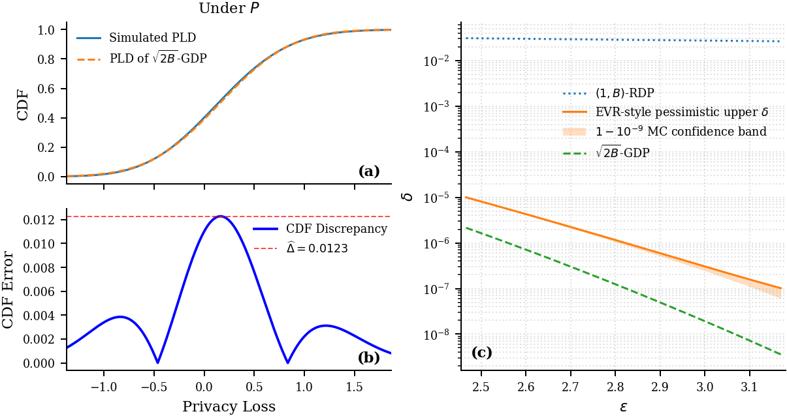

# Revised Numerical Validation

This repository contains the replacement numerical validation for the approximate GDP filter. The theoretical results are unchanged.

> **At a glance:** for each of five Poisson-subsampling rates, we simulate **$10^{10}$ stopped trajectories in each adjacency direction**, estimate the privacy curve through bounded hockey-stick expectations, and report a simultaneous gridwise confidence band with total failure probability $10^{-9}$.

## Main result



[Open the vector-quality PDF.](figures/CLT_validation.pdf)

For $q=0.1$, the empirical CDF discrepancies are

$$
\widehat{\Delta}_{\mathrm{rem}}=0.01228,\qquad \widehat{\Delta}_{\mathrm{add}}=0.01450.
$$

The final estimate is their maximum, $\widehat{\Delta}=0.01450$.

| $q$ | Final empirical CDF discrepancy $\widehat{\Delta}$ | GDP parameter $\sqrt{2B}$ |
|---:|---:|---:|
| 0.01 | 0.003533 | 0.1775 |
| 0.1 | 0.01450 | 0.5612 |
| 0.199 | 0.02584 | 0.7897 |
| 0.801 | 0.01461 | 1.416 |
| 0.95 | 0.004735 | 1.454 |

The empirical discrepancy is largest at intermediate $q$ and decreases toward the two asymptotic regimes, consistent with the paper's asymptotic prediction.

## Experimental design

- **Mechanism:** independently Poisson-subsampled Gaussian mechanisms.
- **Adaptive rule:** the AdaGrad-inspired history-dependent rule from the paper.
- **Directions:** removal compares $P$ with $Q$ and samples under $P$. Addition compares $Q$ with $P$ and samples under $Q$.
- **Scale:** $10^{10}$ independent trajectories per direction and sampling rate.
- **Stopping:** the cumulative PLRV includes the binding step at which the filter stops.

### Directed privacy-curve estimators

For a remove pair, write

$$
L(y)=\log\frac{P(y)}{Q(y)}.
$$

The directed hockey-stick expectations are

$$
\delta_{\mathrm{rem}}(\varepsilon)=\mathbb E_{y\sim P}\!\left[\left(1-\mathrm e^{\varepsilon-L(y)}\right)_+\right],
$$

and

$$
\delta_{\mathrm{add}}(\varepsilon)=\mathbb E_{y\sim Q}\!\left[\left(1-\mathrm e^{\varepsilon+L(y)}\right)_+\right].
$$

We report

$$
\delta(\varepsilon)=\max\!\left\{\delta_{\mathrm{rem}}(\varepsilon),\delta_{\mathrm{add}}(\varepsilon)\right\}.
$$

Each Monte Carlo summand lies in $[0,1]$.

## Confidence construction

- The failure probability is allocated over both interval sides at every point of the full fixed grid: $5\times2\times700{,}000=7{,}000{,}000$ candidate points, or 14,000,000 sided events in total.
- The simultaneous empirical-Bernstein event has total failure probability $\beta=10^{-9}$.
- Only 1,500 points per directed curve are exported for display. Because the guarantee covers the complete deterministic grid, this display selection incurs no additional penalty.
- The orange curve is the pessimistic release $U_\beta(\varepsilon)+\beta$, where $U_\beta$ is the simultaneous add/remove upper curve.

"EVR-style" refers to the estimate/verify/release distinction of [Wang et al. (2023)](https://papers.neurips.cc/paper_files/paper/2023/hash/6ae7df1f40f5faeda474b36b61197822-Abstract-Conference.html). This repository performs an offline high-confidence calculation; it does not invoke their randomized EVR release theorem.

## Reproduce the public artifacts

The frozen artifacts were generated with Python 3.12 and the pinned dependencies in `requirements.txt`:

```text
python -m pip install -r requirements.txt
python code/pld_mc.py --selftest
python code/audit_coverage.py
python code/reproduce_paper.py
```

The final two commands regenerate the confidence audit, tables, six PDFs, and the main PNG preview from the aggregated `N1e10` JSONs. They do not rerun the $10^{10}$ trajectories.

Verify the frozen snapshot on systems providing `sha256sum`:

```text
sha256sum -c SHA256SUMS
```

## Repository guide

| Path | Contents |
|---|---|
| [`APPENDIX_G_REPLACEMENT.md`](APPENDIX_G_REPLACEMENT.md) | Camera-ready-style Appendix G replacement |
| [`EXPERIMENT_REVISION_NOTES.md`](EXPERIMENT_REVISION_NOTES.md) | Changes and rebuttal-specific scope |
| [`TABLES.md`](TABLES.md) | Browser-viewable numerical tables |
| [`data/coverage_audit.json`](data/coverage_audit.json) | Machine-readable simultaneous confidence construction |
| [`data/`](data/) | Frozen aggregate results for all five sampling rates |
| [`code/`](code/) | Simulation, audit, and artifact-generation code |
| [`figures/`](figures/) | Main figures and one figure for each $q$ |
| [`tables.tex`](tables.tex) | Generated LaTeX source for the tables |
| [`SHA256SUMS`](SHA256SUMS) | Hashes for every frozen public file other than the manifest |

## Scope

The experiment instantiates one AdaGrad-inspired adaptive rule; it does not optimize over all admissible adaptive strategies. The confidence band is gridwise rather than continuous in $\varepsilon$. The comparison uses the zero-slack $G_{\sqrt{2B}}$ reference rather than the theorem's $\Delta$ approximate finite-regime guarantee.

The frozen JSONs are the merged aggregate products used for all displayed artifacts. Raw trajectories and compute-specific shard files are not distributed because of their scale; `code/pld_mc.py` provides the same simulation logic for reruns at lower values of $N$.
